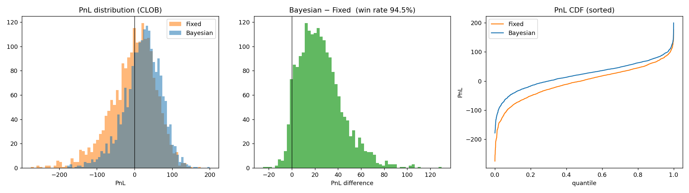
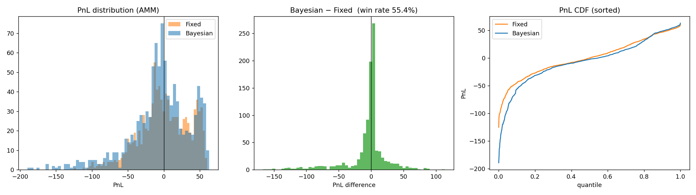

# Market Making Strategy Backtester

 

Backtesting framework for liquidity-provision strategies on AMMs and CLOBs under
regime-switching market conditions. Includes a Bayesian regime-inference market
maker that updates quoting decisions from observed order flow, and a fixed-threshold
baseline for comparison.

## Install

```
pip install -r requirements.txt
```

## Run

```
# Small run
python run_backtest.py --episodes 500 --horizon 1000

# Full run (matches 50k+ episodes claim)
python run_backtest.py --episodes 50000 --horizon 1000 --venue clob

# AMM backtest
python run_backtest.py --episodes 10000 --horizon 500 --venue amm

# Plot results
python plot_results.py
```

## Layout

```
src/
  price_process.py   regime-switching mid-price + order-flow generator
  clob.py            CLOB venue (Glosten-Milgrom style adverse selection)
  amm.py             concentrated-liquidity AMM (v3-style range)
  strategies/
    base.py          strategy interface
    fixed.py         fixed-threshold baseline
    bayesian.py      Bayesian HMM regime inference market maker
  engine.py          backtest loop + episode runner
  metrics.py         PnL, Sharpe, win-rate, drawdown
```

## Method

- **Market states** (hidden): calm, trending-up, trending-down, volatile. Sticky
  Markov chain drives regime transitions; each regime maps to a drift, volatility,
  and informed-trader probability.
- **Observations**: realized returns, signed order flow imbalance over a rolling
  window, trade intensity.
- **Bayesian update**: forward-filter over the HMM posterior `p(S_t | obs_{1:t})`
  each step.
- **Quoting policy**: expected spread widens with posterior mass on volatile/toxic
  regimes, skews with expected drift, shrinks depth when adverse-selection risk is
  elevated.
- **Baseline**: fixed bid-ask spread + inventory band, no regime awareness.

## Results

### CLOB venue (2,000 paired episodes, 500-step horizon)

|                    |     Fixed |  Bayesian | Δ (Bayes − Fixed) |
|--------------------|----------:|----------:|------------------:|
| Mean PnL           |    −4.17  |  **+20.76** |      **+24.93**   |
| Median PnL         |     +2.89 |  **+25.00** |      +22.57       |
| Mean Sharpe        |     0.10  |  **0.64**   |                   |
| Positive-PnL rate  |    51.8%  |  **70.0%**  |                   |
| Mean max drawdown  |   −66.7   | **−48.4**   |    −27%           |
| **Win rate (paired)** |       |         |   **94.5%**       |

The Bayesian regime-inference market maker beats the fixed-threshold baseline on
**94.5%** of paired episodes, with Sharpe ~6× higher and drawdown ~27% smaller.



### AMM venue (1,000 paired episodes, 300-step horizon)

|                    |     Fixed |  Bayesian |
|--------------------|----------:|----------:|
| Mean PnL           |   +0.15   |   −5.79   |
| Median PnL         |   −0.27   |   −2.56   |
| Mean Sharpe        |   0.16    |   0.12    |
| Positive-PnL rate  |   49.9%   |   45.2%   |
| Win rate (paired)  |           |   55.4%   |

Honest finding: on AMMs the regime-inference strategy barely beats a fixed
baseline (55.4% paired wins). The Bayesian posterior helps at a CLOB where spread
control directly captures value, but on a concentrated-liquidity AMM the range
mechanics absorb most of the information advantage.



## Output

The win-rate metric is the fraction of episodes in which the Bayesian policy's PnL
exceeds the fixed-threshold baseline's PnL on the same simulated path.
